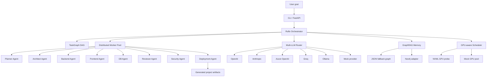

# Architecture — Distributed Multi-LLM Agentic SDLC Platform with Ruflo

This project is a Ruflo-inspired multi-agent SDLC platform. It coordinates
specialized agents through a central orchestrator, routes prompts across
multiple LLM providers, schedules work with GPU awareness, and stores reusable
patterns in GraphRAG memory.

## System Overview



## Core Flow

1. A user submits a goal such as:
   `Build a scalable GPU telemetry dashboard with FastAPI + React.`
2. The CLI or API creates a `RunContext`.
3. The orchestrator builds a DAG of SDLC tasks.
4. The planner and architect run first, enriched by GraphRAG memory retrieval.
5. Implementation agents generate backend, frontend, and database assets.
6. Review, security, and deployment agents validate and package the result.
7. The memory system stores successful patterns from the run.
8. A replayable `trace.json` and all generated artifacts are written to disk.

## Major Components

### Ruflo Orchestrator

The orchestrator owns coordination. Agents do not call one another directly;
they only read from and write to the shared `RunContext`.

Responsibilities:

- Create and execute the SDLC DAG.
- Submit ready tasks to the worker pool.
- Ask the scheduler for CPU/GPU placement.
- Route each agent through the LLM router.
- Emit trace events for replay and debugging.
- Persist artifacts and memory updates.

### Run Context

`RunContext` is the run-scoped blackboard.

It contains:

- `goal`: the original user request.
- `blackboard`: structured intermediate outputs.
- `artifacts`: generated files.
- `events`: trace events.
- `run_dir`: filesystem output directory.

### Agent Model

Every specialized SDLC worker implements the same contract:

```python
class Agent(ABC):
    name: str
    role: str

    async def run(self, ctx: RunContext) -> AgentResult:
        ...
```

Agents should stay narrow and deterministic around their domain:

- Planner decomposes work.
- Architect defines services and data flow.
- Backend creates API code.
- Frontend creates UI code.
- DB creates schema and migrations.
- Reviewer validates maintainability.
- Security checks vulnerabilities and secrets.
- Deployment creates Docker and Kubernetes manifests.

### Multi-LLM Router

The router hides provider-specific APIs from agents. Agents ask for a role and a
prompt; the router chooses a provider according to policy.

Routing examples:

| Agent role | Preferred capability |
|------------|----------------------|
| planner    | strong reasoning     |
| architect  | strong reasoning     |
| backend    | code generation      |
| frontend   | fast code generation |
| reviewer   | critique/reasoning   |
| security   | security reasoning   |

If no provider credentials exist, the router uses `MockProvider`, allowing CI
and local demos to run without paid API keys.

### GraphRAG Memory

The memory layer stores successful patterns as a graph.

Node types:

- `Run`
- `Pattern`
- `Decision`
- `Component`
- `AntiPattern`

Edge types:

- `USES`
- `DERIVED_FROM`
- `REPLACES`
- `CONFLICTS_WITH`

The first implementation uses a JSON-backed graph. Neo4j can be enabled later
without changing agent code.

### GPU-aware Scheduler

The scheduler assigns tasks based on declared resource requirements.

- CPU-only agents run through normal worker slots.
- GPU-heavy agents can request `weight_gpu > 0`.
- If NVML is available, real GPU memory/utilization is used.
- If no GPU exists, a mock GPU pool keeps development deterministic.

### Distributed Execution

The default execution engine is an `asyncio` worker pool. A Ray-backed pool is
planned as an optional extension so the same DAG can scale across nodes.

## Artifact Layout

A run writes artifacts to:

```text
out/<run_id>/
  PLAN.md
  ARCHITECTURE.md
  REVIEW.md
  SECURITY.md
  trace.json
  app/
    backend/
    frontend/
  db/
  deploy/
```

## Milestone Relationship

The build plan is tracked in `PLAN.md`.

This architecture document describes the intended system shape; the milestone
plan describes the order in which that system is implemented.

